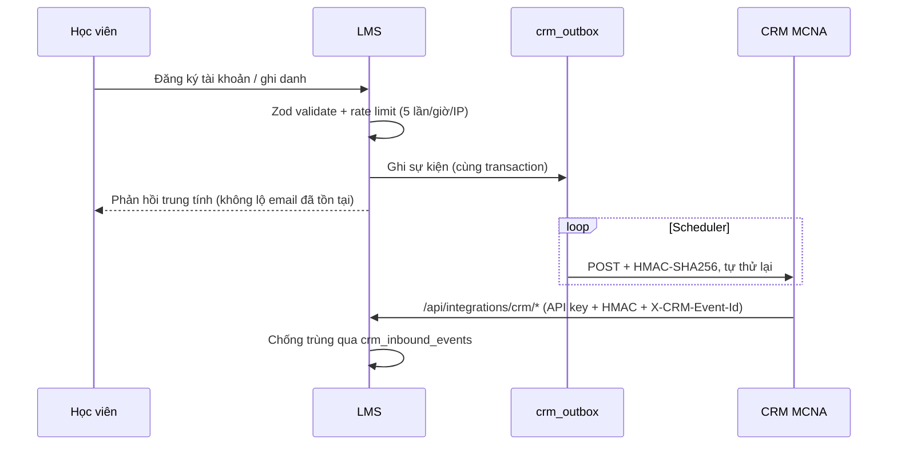
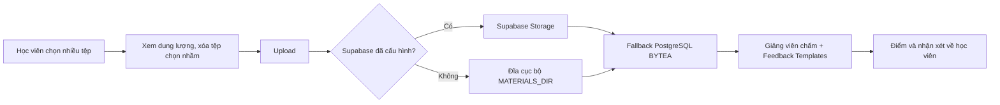
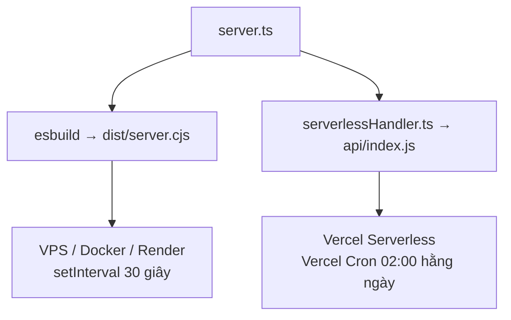

# Báo cáo phân tích repository MCNA LMS

**Phiên bản:** 2.0 · **Ngày:** 18/09/2026 · **Commit đối chiếu:** `5c6c052` (nhánh `main`)

> Mọi số liệu trong tài liệu này đều được đo trực tiếp trên mã nguồn tại commit trên, không suy đoán. Cách kiểm chứng lại ở [Phụ lục A](#phụ-lục-a--cách-kiểm-chứng-lại-các-số-liệu).

---

## 0. Đọc gì trước nếu bạn chỉ có 5 phút

Ba việc cần xử lý trước khi làm bất cứ thứ gì khác:

| # | Vấn đề | Bằng chứng | Công sức |
|---|---|---|---|
| 1 | **`main` không qua được typecheck** | `npm run lint` → `AssignmentSubmit.tsx(319,31): error TS2304: Cannot find name 'setExistingAttachment'` | 1 dòng |
| 2 | **`npm run build` không hề typecheck** nên lỗi trên vẫn build và deploy được | script build là `vite build && esbuild …`, không có `tsc` | 1 dòng |
| 3 | **Không có một bài test tự động nào** trong khi hệ thống đã chạm tới tiền và CRM | không có test runner trong `package.json`, không có file `*.test.ts*` | vài ngày |

Vấn đề 1 và 2 cộng lại nghĩa là: hiện tại **không có cơ chế nào chặn code hỏng đi ra production**.

---

## 1. Tổng quan hệ thống

**MCNA LMS** – hệ thống quản trị đào tạo trực tuyến của Học viện Công nghệ MCNA.

**Vòng đời nghiệp vụ cốt lõi:**

```
Danh mục công khai → Đăng ký lớp → Thanh toán (SePay/VietQR) → Duyệt & xếp lớp
  → Học qua Zoom → Tài liệu buổi học → Quiz → Nộp bài (đa tệp) → Chấm điểm → Chứng chỉ
```

Song song, mọi sự kiện tuyển sinh/ghi danh được đẩy sang CRM MCNA qua webhook có ký HMAC.

### Lịch sử kiến trúc

Hệ thống khởi nguồn từ một nền tảng **SIS/LMS đại học (E16)**: năm học, học kỳ, khoa, ngành, học bổng, phúc khảo, cố vấn học tập, tài khoản phụ huynh, học phí. Sau đó được chuyển dịch sang mô hình bán khóa học online của MCNA: gom về 3 vai trò (`admin` / `teacher` / `student`), đưa link Zoom lên đầu buổi học, thay màn kế toán nội bộ bằng luồng đơn hàng + CRM.

**Cuộc chuyển dịch này chưa hoàn tất.** Mức độ cụ thể ở [§7.1](#71--di-sản-sis-chưa-dọn-hết).

---

## 2. Công nghệ

| Tầng | Công nghệ | Ghi chú |
|---|---|---|
| Frontend | React `^19.0.1`, TypeScript `~5.8.2`, Vite `^6.2.3` | SPA |
| Styling | Tailwind CSS `^4.1.14` (qua `@tailwindcss/vite`) | utility-first |
| State | `@tanstack/react-query` `^5.100.14` **+** `AppStore` thủ công | dùng song song – xem [§7.2](#72--hai-hệ-quản-lý-state-chạy-song-song) |
| Backend | Express `^4.21.2`, chạy dev bằng `tsx`, build bằng `esbuild` | 108 route trong 1 file |
| Database | PostgreSQL (`pg` `^8.21.0`) | 38 migration, ~52 bảng |
| Cache/Queue | `ioredis` `^5.10.1` | tùy chọn |
| Lưu trữ tệp | Supabase Storage → đĩa cục bộ → PostgreSQL `BYTEA` | 3 tầng, thứ tự như liệt kê |
| Thanh toán | SePay.vn webhook (MB Bank / VietQR) | có idempotency |
| Bảo mật | JWT HttpOnly, CSRF double-submit, HMAC-SHA256, Zod `^4.4.3`, rate limit | |
| Xuất báo cáo | `exceljs`, `archiver` | CSV + XLSX |
| Deploy | Monolith `dist/server.cjs` **và** Vercel Serverless `api/index.js` | kiến trúc kép |

**Thiếu:** không khai báo trường `engines` trong `package.json` → Vercel/Render tự chọn phiên bản Node, có thể đổi mà không ai biết. Tên package cũng vẫn là `"react-example"`.

---

## 3. Cấu trúc thư mục

```
lms_mcna/
├── api/index.js                    # Bundle Vercel Serverless (478 KB) — ĐƯỢC COMMIT vào git
├── server.ts                       # 4.771 dòng, 108 route API
├── docs/                           # BRD, hợp đồng CRM, hướng dẫn, rollback, backup
├── migrations/postgres/            # 38 file (001 → 037)
├── scripts/                        # migrate, seed, drift-check, purge, import catalog, 3 script E2E thủ công
└── src/
    ├── components/
    │   ├── admin/ teacher/ student/ public/ icons/
    │   ├── AdminPanel.tsx  TeacherPanel.tsx  StudentPanel.tsx
    │   └── CourseSectionManager.tsx  SessionMaterials*.tsx  LinkedText.tsx …
    ├── hooks/apiHooks.ts           # Nơi duy nhất tập trung React Query
    ├── server/
    │   ├── crm/                    # crmOutbox.ts, signature.ts
    │   ├── data/mcnaCatalog.json   # 14 khóa + 11 lớp thật từ mcna.vn
    │   ├── emailProvisioning/      # Cấp mail Google Workspace
    │   ├── repositories/           # 14 repository theo domain
    │   ├── services/               # 7 service: enrollment, sepay, storage, catalogImport, …
    │   └── scheduler.ts  db.ts  mappers.ts  validation.ts  seedCore.ts
    ├── store.ts                    # AppStore thủ công (611 dòng)
    └── types.ts                    # Interface dùng chung
```

### Các file lớn nhất (dòng)

| File | Dòng |
|---|---|
| `server.ts` | 4.771 |
| `src/components/teacher/CourseBuilder.tsx` | 2.109 |
| `src/components/teacher/QuizBuilder.tsx` | 1.745 |
| `src/components/CourseSectionManager.tsx` | 1.655 |
| `src/components/student/MyLearningWorkspace.tsx` | 1.396 |
| `src/App.tsx` | 1.167 |
| `src/components/AdminPanel.tsx` | 1.161 |

Tổng `src/` + `server.ts` ≈ **30.578 dòng**.

---

## 4. Các luồng nghiệp vụ

### 4.1. Tuyển sinh & CRM hai chiều



**Điểm đáng chú ý:**

- **Transactional outbox:** sự kiện ghi vào `crm_outbox` cùng transaction nghiệp vụ → CRM sập không làm mất dữ liệu.
- **Ký HMAC:** `hex(HMAC(secret, "<timestamp>.<rawBody>"))`, dung sai chống replay 300 giây (`CRM_SIGNATURE_TOLERANCE_SECONDS`).
- **Idempotency hai chiều:** `X-CRM-Event-Id` + bảng `crm_inbound_events`.
- **Phản hồi trung tính** khi email đã tồn tại → không rò rỉ danh bạ học viên.
- **Bắt buộc đổi mật khẩu lần đầu** (`must_change_password`) chặn toàn bộ API khác cho tới khi đổi xong.

> ⚠️ **Tích hợp này chưa chạy thật.** `CRM_WEBHOOK_URL` và `CRM_WEBHOOK_SECRET` để trống trong `.env.example` và chưa được cấu hình ở đâu. Toàn bộ chiều LMS → CRM mới chỉ được kiểm thử với `scripts/mockCrmServer.ts`. Hợp đồng kỹ thuật (`docs/crm-integration.md`) đã hoàn chỉnh và phía LMS đã sẵn sàng — việc còn lại nằm ở phía CRM.

### 4.2. Khóa học → Lớp → Buổi học → Zoom & tài liệu

| Thực thể | Bảng | Vai trò |
|---|---|---|
| Khóa học | `courses` | Mô tả, danh mục, ảnh, bài học. Vòng đời: `draft` → GV nộp duyệt → admin `published` / `rejected` |
| Lớp học phần | `course_sections` | Nhiều lớp/khóa (ngày, tối, cuối tuần), sĩ số tối đa, lịch tuần, ngày khai giảng |
| Buổi học | `attendance_sessions` | Tự sinh theo thời khóa biểu lớp |
| Tài liệu | `session_materials`, `material_files` | Slide, Word, Excel, PDF, video YouTube, link ngoài |

Link Zoom đặt ngay đầu buổi học (thay cho việc rải link qua Zalo). Giao diện dùng logo chính hãng Zoom / Word / Excel / PowerPoint / PDF trong `src/components/icons/BrandLogos.tsx`.

### 4.3. Nộp bài đa tệp & chấm bài



Trên Vercel, `MATERIALS_DIR` rơi về `os.tmpdir()` — thư mục này **bị xóa sau mỗi lần cold start**, nên tầng `BYTEA` không phải "phòng xa" mà là tầng bền vững duy nhất khi thiếu Supabase. Cần hiểu đúng điều này khi vận hành.

### 4.4. Điểm danh — trạng thái thực tế

Đây là chỗ bản phân tích trước tự mâu thuẫn. Thực tế tại `5c6c052`:

| Thành phần | Trạng thái |
|---|---|
| API điểm danh (`/api/attendance/*`) | **Còn sống** — 11 route: self-checkin mã 6 ký tự, QR động, teacher-checkin |
| Repository `attendance.ts`; bảng `attendance_records`, `teacher_attendance`, `attendance_qr_sessions` | **Còn sống** |
| Giao diện quản lý điểm danh của giảng viên | **Đã gỡ** (commit `b3576d9`) |
| Job cảnh báo chuyên cần (`runAttendanceRiskJob`) | **Đã vô hiệu hóa** — trả về `"Attendance risk tracking disabled for online courses."` |
| `src/server/services/attendanceRisk.ts` | **Code chết** — không còn nơi nào gọi |
| Bộ đếm `attendanceRisks` trên dashboard admin | Vẫn đọc bảng `attendance_risk_alerts` → **luôn hiện số cũ đóng băng** |

→ Không phải "đã loại bỏ điểm danh", mà là **backend còn nguyên, frontend đã gỡ, job đã tắt**. Đây là trạng thái nửa vời cần chốt dứt điểm (xem [§7.3](#73--điểm-danh-nửa-gỡ-nửa-giữ)).

Báo cáo chuyên cần và bảng điểm vẫn xuất được CSV và XLSX.

---

## 5. Kiến trúc kép (Dual-runtime)



### ⚠️ Cùng một code, độ trễ chênh 2.880 lần

`setInterval` không chạy trên serverless, nên việc đẩy `crm_outbox` được kích hoạt bằng Vercel Cron:

| Môi trường | Cơ chế | Chu kỳ đẩy CRM |
|---|---|---|
| Self-hosted | `setInterval` trong `scheduler.ts` | **30 giây** |
| Vercel | `vercel.json` → `"schedule": "0 2 * * *"` | **24 giờ** |

Lịch chạy mỗi ngày một lần là do giới hạn gói **Vercel Hobby**. Nghĩa là trên Vercel, một học viên đăng ký lúc 02:05 sẽ chỉ xuất hiện trong CRM **gần 24 tiếng sau**. Nếu nghiệp vụ tuyển sinh không chấp nhận độ trễ đó thì phải nâng gói Vercel, hoặc chuyển hẳn sang Render/VPS, hoặc gọi endpoint cron từ một scheduler bên ngoài. Endpoint đã được bảo vệ bằng `CRON_SECRET` nên gọi từ ngoài là an toàn.

### Dev In-Memory Mock Store

Khi `DATABASE_URL` trỏ localhost, không kết nối được, **và** `NODE_ENV !== "production"`, server tự bật kho dữ liệu giả trong RAM để chạy được giao diện mà không cần cài PostgreSQL. Tiện cho người mới clone repo.

> **Nhưng đây cũng là một cái bẫy đã gây mất thời gian thật.** Server ở chế độ này trả dữ liệu giả một cách im lặng qua toàn bộ API — dấu hiệu duy nhất là `GET /api/health` trả `{"database":"mock_in_memory"}` và một dòng cảnh báo lúc khởi động đã trôi mất trong log. Khi có tiến trình dev cũ còn treo ở cổng 3000, mọi kiểm thử phía sau đều cho kết quả sai lệch. **Luôn kiểm tra `/api/health` trước khi tin bất kỳ kết quả test cục bộ nào.**

---

## 6. Bảo mật

| Lớp | Cơ chế |
|---|---|
| Phiên đăng nhập | JWT ký bằng `JWT_SECRET`, cookie `HttpOnly` + `SameSite=Lax` + `Secure` (prod), TTL 8 giờ |
| Chống mở 2 tài khoản | Single-browser-session: phát hiện và chặn 2 tài khoản khác nhau trên cùng trình duyệt |
| CSRF | Double-submit: cookie `e16_lms_csrf` + header `X-CSRF-Token`; middleware `requireCsrf` chặn mọi POST/PUT/PATCH/DELETE |
| Validate đầu vào | Zod trên toàn bộ request body (`src/server/validation.ts`) |
| Rate limit | Theo IP: đăng ký 5/giờ · quên mật khẩu 5/15 phút · catalog công khai 120/phút · CRM 300/phút. Tắt được bằng `DISABLE_RATE_LIMIT` |
| Webhook CRM | HMAC-SHA256 + timestamp, dung sai 300 giây |
| Webhook thanh toán | `PAYMENT_WEBHOOK_SECRET` + idempotency qua `payment_webhook_events` |
| QR điểm danh | Ký bằng `ATTENDANCE_QR_SECRET`, QR động |
| Audit | Bảng `audit_logs` ghi mọi hành động nhạy cảm |
| Cron nội bộ | Bearer `CRON_SECRET` |

Tên cookie `e16_lms_csrf` vẫn mang tiền tố hệ thống cũ — vô hại về kỹ thuật nhưng là dấu vết còn sót.

---

## 7. Nợ kỹ thuật — xếp theo mức ưu tiên

### 7.0. 🔴 Không có lưới an toàn nào cho chất lượng code

Đây là hạng mục nghiêm trọng nhất và bản phân tích trước **không nhắc tới**.

- **Không có bài test tự động nào.** Không test runner, không file `*.test.ts*`. Ba script `e2eSignupCrmFlow.ts` / `smokeDeploy.ts` / `testSepayWebhook.ts` là kiểm thử **thủ công**, phải có người chạy và người đọc kết quả.
- **`npm run lint` (`tsc --noEmit`) đang fail** tại `src/components/student/AssignmentSubmit.tsx:319`: gọi `setExistingAttachment(null)` trong khi state `existingAttachment` đã bị xóa ở đợt refactor nộp đa tệp (`5c6c052`). Xóa dòng đó là hết lỗi.
- **`npm run build` không typecheck.** Vite và esbuild đều chỉ transpile, không kiểm tra kiểu. Đã xác nhận bằng thực nghiệm: build chạy **thành công** dù typecheck fail.

**Việc cần làm, theo thứ tự:**

1. Xóa dòng `setExistingAttachment(null);` *(1 phút)*
2. Đổi build script thành `tsc --noEmit && vite build && esbuild …` *(1 phút)*
3. Thêm CI chạy `npm run lint` trên mọi push *(30 phút)*
4. Thêm Vitest + test cho các luồng chạm tiền và CRM: ký HMAC, idempotency outbox, khớp giao dịch SePay, chấm quiz *(vài ngày)*

### 7.1. 🟠 Di sản SIS chưa dọn hết

Không phải "còn một vài trường" như bản trước mô tả, mà là **17 bảng nguyên vẹn**:

`academic_warnings`, `academic_years`, `advisor_assignments`, `advisor_notes`, `departments`, `grade_appeals`, `graduation_applications`, `leave_requests`, `parent_links`, `program_courses`, `programs`, `registration_periods`, `scholarship_applications`, `scholarships`, `semesters`, `student_profiles`, `tuition_fees`

Các bảng này **không còn nghiệp vụ nào đọc hay ghi**. Nơi duy nhất nhắc tới chúng là danh sách `TRUNCATE` trong `scripts/dbSeed.ts` và danh sách `DELETE` trong `scripts/purgeMockData.ts` — tức chỉ là dọn dẹp, không phải sử dụng.

Trong `src/types.ts` thì đã sạch gần hết: chỉ còn `credits` (dòng 317). Hai trường `semester` và `major` mà bản phân tích trước nêu thì **đã được gỡ rồi**.

Việc giữ lại bảng là **quyết định có chủ ý** để bảo toàn dữ liệu lịch sử. Nhưng cần ghi rõ quyết định đó vào một migration hoặc README schema, nếu không người tiếp nhận sau sẽ mất thời gian đúng như đợt phân tích này.

### 7.2. 🟠 Hai hệ quản lý state chạy song song

| Cách tiếp cận | Số file dùng |
|---|---|
| React Query (`useQuery` / `useMutation`) | **3** — `App.tsx`, `StudentPanel.tsx`, `hooks/apiHooks.ts` |
| `AppStore` thủ công (`src/store.ts`) | **11** |

→ Mô tả "React Query v5 + Optimistic Updates cho phản hồi 0ms" của bản trước là **nói quá**. Cơ chế đó có thật nhưng mới phủ phần nộp bài của học viên; phần lớn ứng dụng vẫn chạy trên store thủ công. Nên nêu đúng là *"đã bắt đầu chuyển sang React Query, hiện phủ 3 file"* thay vì coi là thế mạnh toàn cục.

### 7.3. 🟡 Điểm danh: nửa gỡ nửa giữ

Xem bảng ở [§4.4](#44-điểm-danh--trạng-thái-thực-tế). Cần một quyết định nghiệp vụ dứt khoát:

- **Nếu bỏ hẳn:** gỡ 11 route `/api/attendance/*`, file `attendanceRisk.ts`, và bộ đếm `attendanceRisks` trên dashboard admin.
- **Nếu giữ để học viên tự check-in:** khôi phục giao diện, và bật lại job cảnh báo *nhưng phải sửa logic trước* — logic cũ coi "không có bản ghi điểm danh" là "vắng mặt", trong khi 18/18 buổi đã qua đều không có bản ghi nào, nên nó sẽ báo động giả cho toàn bộ học viên.

Không quyết thì phần code này sẽ mục dần và bộ đếm trên dashboard admin vẫn hiển thị số sai.

### 7.4. 🟡 `server.ts` 4.771 dòng / 108 route

Mọi route API nằm trong một file. Đề xuất tách theo domain vào `src/server/routes/`: `auth.ts`, `courses.ts`, `sections.ts`, `assignments.ts`, `quizzes.ts`, `attendance.ts`, `payments.ts`, `crm.ts`, `admin.ts`, `reports.ts`.

Tầng repository (14 file) và service (7 file) đã tách sẵn, nên đây chủ yếu là việc di chuyển route handler — rủi ro thấp, lợi ích cao cho làm việc nhóm. **Nên làm sau khi có test**, không phải trước.

### 7.5. 🟡 Bundle serverless được commit vào git

`api/index.js` (478 KB) nằm trong git, trong khi `dist/` lại bị `.gitignore`. Hệ quả: mỗi lần sửa backend đều phải nhớ chạy `npm run build` rồi commit lại bundle, nếu không Vercel sẽ chạy code cũ.

Đã kiểm tra tại `5c6c052`: bundle **hiện đang khớp** với mã nguồn (build lại không tạo ra thay đổi nào trong `git status`). Nhưng không có gì bắt buộc điều đó — không hook, không CI. Nên đưa việc build vào pipeline deploy của Vercel và bỏ file khỏi git, hoặc ít nhất thêm một bước CI kiểm tra bundle không lệch nguồn.

### 7.6. 🟡 Vai trò `super_admin` đã bị khai tử nhưng còn 54 chỗ kiểm tra

Migration `031_consolidate_to_three_roles.sql` đã áp ràng buộc ở tầng database:

```sql
ALTER TABLE users ADD CONSTRAINT users_role_check CHECK (role IN ('admin', 'teacher', 'student'));
```

Không tài khoản nào còn có thể mang role `super_admin`. Nhưng `server.ts` vẫn có **54 chỗ** viết `requireRole([..., "super_admin"])`, cộng thêm `src/store.ts:548` và `src/components/ForumDiscussion.tsx:106,121`.

Đây không phải lỗi — các nhánh đó chỉ đơn giản không bao giờ chạy tới. Nhưng nó khiến người đọc code tưởng hệ thống có 4 vai trò trong khi thực tế chỉ có 3, và làm nhiễu việc rà soát phân quyền. Nên dọn, **nhưng chỉ sau khi đã có test** — sửa 54 điểm kiểm tra quyền mà không có lưới an toàn là rủi ro không đáng.

### 7.7. 🟢 Tài liệu lệch thực tế

`docs/BRD.md` vẫn là **tài liệu của hệ thống E16 LMS/SIS cũ**: tiêu đề "Tài liệu yêu cầu nghiệp vụ E16 LMS/SIS", phạm vi ghi "viết lại theo cấu trúc code hiện tại của repo `D:\LMS`". Nó mô tả khoa/ngành/học kỳ/học bổng — những thứ sản phẩm này không còn làm.

Bản phân tích trước liệt kê file này như BRD hiện hành của MCNA. **Không phải.** Cần viết lại hoặc đánh dấu rõ là tài liệu lưu trữ lịch sử.

Đối chiếu: `docs/crm-integration.md` thì cập nhật tốt, viết chuẩn dạng hợp đồng kỹ thuật — có thể dùng làm mẫu cho việc viết lại BRD.

### 7.8. 🟢 Việc nhỏ

- Thêm `"engines": { "node": ">=20" }` vào `package.json`
- Đổi `"name": "react-example"` → `"mcna-lms"`
- Cân nhắc code-split: bundle frontend vượt 500 KB sau minify (cảnh báo của Vite khi build)
- 38 migration có thể squash thành một baseline schema

---

## 8. Điểm mạnh — những gì đã làm tốt

- **Transactional outbox cho CRM** — lựa chọn kiến trúc đúng. CRM sập, mạng lỗi, deploy giữa chừng đều không làm mất sự kiện. Nhiều đội lớn hơn vẫn làm sai chỗ này.
- **Bảo mật làm nghiêm túc, không hình thức** — CSRF double-submit, rate limit phân biệt theo từng endpoint, idempotency cho cả webhook vào lẫn ra, chống replay bằng timestamp, audit log. Đây là mức chuẩn chỉnh hiếm thấy ở dự án cùng quy mô.
- **Lưu trữ tệp 3 tầng có fallback** — bài nộp của học viên không mất kể cả khi Supabase chưa cấu hình hay serverless xóa đĩa tạm.
- **Có script kiểm tra lệch schema** (`npm run db:drift`) — cho thấy đội đã từng bị schema lệch giữa migration và production và đã chủ động phòng lại.
- **Seed tách bạch dữ liệu thật và dữ liệu demo** — database mới mặc định nạp catalog thật của mcna.vn (14 khóa, 11 lớp); dữ liệu demo chỉ sinh khi bật `SEED_DEMO_DATA=true`. Không còn rủi ro khóa học giả lọt lên production.
- **Giao diện tiếng Việt chuẩn nghiệp vụ đào tạo Việt Nam**, dùng logo chính hãng Zoom/Office/PDF thay vì icon chung chung.

---

## 9. Kết luận

MCNA LMS là một hệ thống **hoàn chỉnh về nghiệp vụ và chín chắn về kiến trúc backend**. Các quyết định khó — outbox, idempotency, fallback lưu trữ, bảo mật nhiều lớp — đều được xử lý đúng.

Khoảng trống không nằm ở tính năng mà ở **kỷ luật kỹ thuật**: không test, không CI, build không typecheck, và một cuộc chuyển dịch SIS → LMS còn dở dang ở ba chỗ (bảng SIS, điểm danh, BRD).

**Lộ trình đề xuất:**

| Giai đoạn | Nội dung | Thời gian |
|---|---|---|
| 1 | Sửa lỗi typecheck · đưa `tsc` vào build · dựng CI | 1 ngày |
| 2 | Test cho luồng tiền và CRM | 3–5 ngày |
| 3 | Chốt số phận điểm danh · dọn code chết | 1–2 ngày |
| 4 | Viết lại BRD · ghi chú quyết định giữ bảng SIS | 1 ngày |
| 5 | Tách `server.ts` theo domain *(sau khi có test)* | 3–5 ngày |
| 6 | Nối CRM thật · chốt chiến lược cron theo môi trường deploy | phụ thuộc phía CRM |

---

## Phụ lục A — Cách kiểm chứng lại các số liệu

```bash
npm run lint                                    # Lỗi typecheck ở §7.0
npm run build                                   # Chứng minh build vẫn qua dù lint fail
wc -l server.ts                                 # 4.771
ls migrations/postgres/*.sql | wc -l            # 38
grep -rl "useQuery\|useMutation" src/ | wc -l   # 3
cat vercel.json                                 # Lịch cron "0 2 * * *"
curl localhost:3000/api/health                  # Kiểm tra có đang chạy mock store không
```

## Phụ lục B — Đính chính so với bản phân tích v1

| Nội dung | Bản v1 | Thực tế |
|---|---|---|
| `docs/BRD.md` | "BRD v2.1 của MCNA" | Tài liệu E16 SIS cũ, đã lỗi thời |
| React Query | "Đồng bộ thời gian thực, 0ms" | Mới phủ 3 file; 11 file vẫn dùng store thủ công |
| Thứ tự lưu trữ tệp | Đĩa → Supabase → BYTEA | Supabase → đĩa → BYTEA |
| Di sản SIS | "Còn vài trường `semester`, `major`, `credits`" | `semester`/`major` đã gỡ; còn `credits` **và 17 bảng** |
| Điểm danh | Vừa nói "đã loại bỏ", vừa nói "còn QR/mã 6 ký tự" | Backend còn, UI đã gỡ, job đã tắt |
| CRM | "Tự động đẩy hai chiều sang CRM MCNA" | Code sẵn sàng nhưng `CRM_WEBHOOK_URL` trống — chưa nối thật |
| Test & CI | Không nhắc tới | Không có test nào; `npm run lint` đang fail |
| Độ trễ cron | Không nhắc tới | 30 giây self-hosted vs 24 giờ trên Vercel |
| `api/index.js` | Không nhắc tới | Bundle 478 KB được commit, không có gì chống lệch nguồn |
| Số vai trò | "Chuẩn hóa về 3 vai trò duy nhất" | Database đúng là 3, nhưng code còn 54 chỗ kiểm tra `super_admin` — nhánh chết |

---

## Phụ lục C — Bản giao việc

Phần §7 đã được chuyển thành danh sách việc có thể thi hành ngay, kèm quy tắc bắt buộc và tiêu chí hoàn thành: [`docs/giao-viec-antigravity.md`](./giao-viec-antigravity.md).
