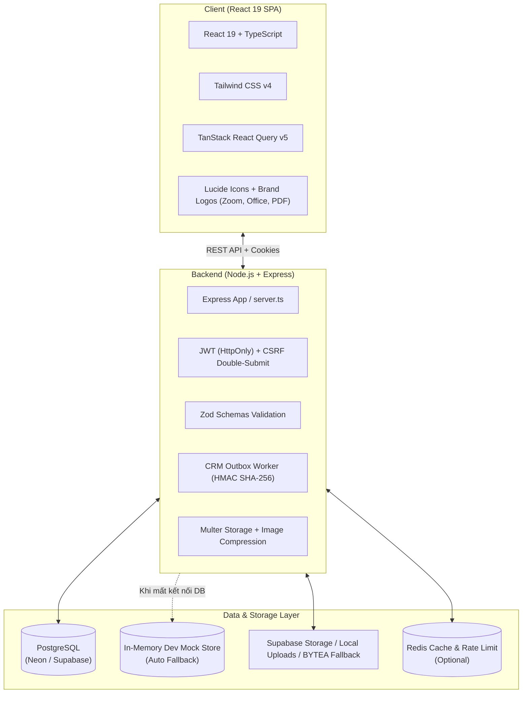
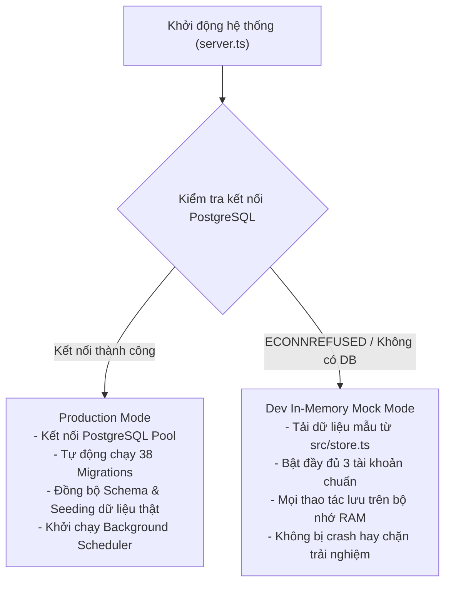

# Báo cáo Phân tích Toàn diện Repository MCNA LMS

**Tên dự án:** MCNA LMS – Hệ thống Quản trị Học tập & Đào tạo Trực tuyến  
**Đơn vị:** Học viện Công nghệ MCNA  
**Ngày lập báo cáo:** 18/09/2026  
**Phiên bản hệ thống:** v1.1  

---

## 1. Tổng quan Dự án & Bối cảnh Phát triển

Hệ thống **MCNA LMS** được thiết kế nhằm phục vụ mục tiêu cốt lõi: **Bán và vận hành khóa học công nghệ trực tuyến** một cách tinh gọn, tự động hóa cao và trải nghiệm người dùng hiện đại:

1. **Tuyển sinh & Tự động hóa bán hàng:** Khách vãng lai xem danh mục khóa học công khai $\rightarrow$ Chọn lớp $\rightarrow$ Tự đăng ký tài khoản $\rightarrow$ Dữ liệu lead/đơn hàng tự động đẩy sang **MCNA CRM**.
2. **Thanh toán & Xếp lớp:** Hỗ trợ cổng thanh toán (SePay/QR) hoặc duyệt giao dịch chuyển khoản $\rightarrow$ Tự động xếp học viên vào lớp học phần đã chọn.
3. **Trải nghiệm Học tập Trực tuyến:** 
   - Vào học trực tiếp qua **link Zoom** được bố trí ngay đầu mỗi buổi học (cắt giảm toàn bộ công đoạn gửi link qua Zalo hoặc chat rời rạc).
   - Tải tài liệu bài giảng trực quan: Slide trình chiếu (`.pptx`, `.pdf`), tài liệu thực hành (`.docx`, `.xlsx`), video YouTube, liên kết ngoài.
   - Làm bài kiểm tra trắc nghiệm (Quiz) tự động tính điểm.
   - Nộp bài tập thực hành tự luận hỗ trợ **nhiều tệp cùng lúc** (Word, Excel, PowerPoint, PDF, ảnh, ZIP...), có thanh tiến độ tải lên thời gian thực.
4. **Vận hành Giảng dạy:**
   - Giảng viên quản lý lớp, cập nhật link Zoom, tải lên tài liệu học tập.
   - Chấm bài tập tự luận với trình xem trước (Preview Modal) trực tiếp các tệp bài làm ngay trên web mà không cần tải về, kèm bộ nhận xét mẫu nhanh (Feedback Templates).
   - Xuất sổ điểm và báo cáo học vụ ra định dạng `Excel (.xlsx)` hoặc `CSV`.

### Quá trình chuyển dịch kiến trúc (Evolution)
- Hệ thống xuất phát điểm từ nền tảng SIS/LMS đại học phức tạp (năm học, học kỳ, khoa, ngành, học bổng, phúc khảo, tài khoản phụ huynh, kế toán nội bộ).
- Hiện tại, toàn bộ hệ thống đã được **chuẩn hóa và tinh giản** triệt để cho mô hình học trực tuyến MCNA:
  - Loại bỏ quy trình điểm danh thủ công rườm rà.
  - Loại bỏ màn hình duyệt kế toán nội bộ (tiền và đơn hàng đồng bộ trực tiếp qua CRM).
  - Chuẩn hóa toàn bộ phân quyền về **3 vai trò duy nhất**: `admin` (Quản trị viên), `teacher` (Giảng viên), `student` (Học viên).

---

## 2. Công nghệ Cốt lõi (Tech Stack)



| Tầng công nghệ | Thư viện / Công cụ | Vai trò & Đặc tính kỹ thuật |
| :--- | :--- | :--- |
| **Frontend Framework** | React `19.0.1`, TypeScript `~5.8.2` | Single-Page Application (SPA), React Server/Client compatibility, StrictType an toàn. |
| **Build Tool** | Vite `6.2.3`, esbuild `0.25.0` | Hot Module Replacement (HMR) siêu tốc, bundle production tối ưu. |
| **Styling** | Tailwind CSS `v4.1.14` | Cấu hình theme gọn gàng, hỗ trợ CSS variables, responsive di động hoàn chỉnh. |
| **Quản lý State & Cache** | `@tanstack/react-query v5` + `AppStore` | Quản lý cache API, refetch tự động, cập nhật lạc quan (Optimistic Update) 0ms. |
| **Backend Runtime** | Node.js (v18+), Express `4.21.2` | Máy chủ RESTful API xử lý routing, middleware bảo mật và xử lý nghiệp vụ. |
| **Validation** | Zod `4.4.3` | Kiểm soát chặt chẽ kiểu dữ liệu đầu vào của toàn bộ các API endpoint. |
| **Cơ sở dữ liệu** | PostgreSQL (`pg 8.21.0`), Neon / Supabase | Lưu trữ dữ liệu quan hệ với 38 file migrations quản lý cấu trúc schema. |
| **Lưu trữ Tệp tin** | Supabase Storage + Local uploads + PostgreSQL `BYTEA` | Kiến trúc 3 tầng dự phòng chống mất file khi chạy trên Vercel Serverless. |
| **Tích hợp Bên ngoài** | HMAC-SHA256, Google Workspace API, SePay | Đồng bộ CRM 2 chiều, cấp phát email trường, tự động hóa thanh toán. |

---

## 3. Cấu trúc Thư mục Dự án & Phân nhiệm Module

```
lms_mcna/
├── api/
│   └── index.js                      # Entry point chạy Vercel Serverless Function
├── docs/                             # Tài liệu kỹ thuật, BRD, tích hợp CRM, checklist rollback
│   ├── BRD.md                        # Business Requirement Document (v2.1)
│   ├── crm-integration.md            # Hợp đồng tích hợp 2 chiều LMS ↔ CRM MCNA
│   ├── repo-analysis.md              # Báo cáo phân tích toàn diện repository
│   └── user-guide-full.md            # Hướng dẫn sử dụng chi tiết cho 3 vai trò
├── migrations/
│   └── postgres/                     # 38 file migrations quản lý tiến hóa database
├── scripts/                          # Scripts vận hành: migrate, seed, import catalog, E2E test
├── src/
│   ├── components/
│   │   ├── admin/                    # Phân hệ Quản trị viên (AdminOrdersManager)
│   │   ├── teacher/                  # Phân hệ Giảng viên (CourseBuilder, AssignmentGrader, QuizBuilder)
│   │   ├── student/                  # Phân hệ Học viên (MyLearningWorkspace, AssignmentSubmit, CourseCatalog)
│   │   ├── public/                   # Trang công khai: PublicCourseCatalog, AccountForms, Certificate
│   │   ├── icons/BrandLogos.tsx      # SVG chính hãng: Zoom, Word, Excel, PowerPoint, PDF
│   │   ├── AdminPanel.tsx            # Bảng điều khiển quản trị viên
│   │   ├── TeacherPanel.tsx          # Bảng điều khiển giảng viên
│   │   └── StudentPanel.tsx          # Bảng điều khiển học viên
│   ├── server/
│   │   ├── crm/                      # Outbox pattern đồng bộ CRM & chữ ký HMAC
│   │   ├── data/mcnaCatalog.json     # Dữ liệu chuẩn 14 khóa học & syllabus từ mcna.vn
│   │   ├── emailProvisioning/        # Cấp phát Google Workspace & gửi mail thông báo
│   │   ├── repositories/             # 14 repositories truy vấn PostgreSQL theo domain
│   │   ├── services/                 # Business logic: enrollment, scheduling, sepay, storage
│   │   ├── db.ts                     # Cấu hình Pool kết nối PostgreSQL (hỗ trợ Supabase Pooler)
│   │   ├── mappers.ts                # Ánh xạ từ DB snake_case sang TypeScript camelCase
│   │   └── validation.ts             # Bộ schema Zod kiểm tra tính hợp lệ của mọi request API
│   ├── submissionFiles.tsx           # Tiện ích quản lý đa tệp bài nộp & icon thương hiệu
│   ├── store.ts                      # Client store & seed data mẫu ban đầu
│   ├── types.ts                      # Toàn bộ Interface dữ liệu TypeScript dùng chung
│   ├── App.tsx                       # Shell chính, điều hướng vai trò, modal đăng nhập/đổi mật khẩu
│   └── main.tsx                      # Bootstrap React App
├── server.ts                         # Express server chính (~4.700 dòng code API)
└── package.json                      # Cấu hình dependencies, build & deploy scripts
```

---

## 4. Các Luồng Nghiệp vụ Trọng tâm

### 4.1. Tuyển sinh, Tự đăng ký học viên & Đồng bộ CRM MCNA
- **Học viên tự tạo tài khoản:** Đăng ký trực tiếp bằng họ tên, email cá nhân, số điện thoại (`POST /api/auth/register`). Hệ thống tự sinh mật khẩu tạm thời gửi qua email (hoặc hiển thị ngay trên màn hình ở môi trường dev).
- **Cơ chế bảo mật email:** Phản hồi đăng ký giống nhau dù email đã tồn tại hay chưa, ngăn chặn hành vi dò tìm danh sách người dùng.
- **Bắt buộc đổi mật khẩu:** Khi đăng nhập bằng mật khẩu tạm, tài khoản rơi vào trạng thái `mustChangePassword = true`. Giao diện tự động khóa toàn bộ các phân hệ khác và hiển thị màn hình đổi mật khẩu bắt buộc.
- **Đồng bộ 2 chiều với CRM:**
  - **LMS $\rightarrow$ CRM:** Áp dụng **Transactional Outbox Pattern** (`crm_outbox`). Các sự kiện (`contact.registered`, `enrollment.requested`, `enrollment.status_changed`) được ghi vào DB trong cùng transaction nghiệp vụ, worker chạy nền gửi webhook mỗi 30 giây kèm chữ ký bảo mật **HMAC-SHA256**, tự động thử lại tối đa 10 lần nếu CRM gặp sự cố.
  - **CRM $\rightarrow$ LMS:** Các endpoint `/api/integrations/crm/*` cho phép CRM tạo học viên, duyệt ghi danh, xếp lớp và xác nhận thanh toán tự động, kiểm soát chữ ký HMAC và chống trùng lặp sự kiện theo `X-CRM-Event-Id`.

### 4.2. Khóa học $\rightarrow$ Lớp học $\rightarrow$ Buổi học $\rightarrow$ Link Zoom & Tài liệu
- **Khóa học (`courses`):** Khóa học có vòng đời `draft` $\rightarrow$ Giảng viên nộp duyệt $\rightarrow$ Admin phê duyệt (`published`) hoặc từ chối (`rejected`).
- **Lớp học phần (`course_sections`):** Thiết lập thời khóa biểu hàng tuần (thứ trong tuần, giờ bắt đầu/kết thúc), giảng viên phụ trách, sĩ số tối đa.
- **Tự động sinh buổi học (`attendance_sessions`):** Hệ thống tự động sinh các buổi học theo số buổi của lớp và ngày khai giảng.
- **Vị trí Link Zoom:** Link học Zoom được hiển thị **ngay trên đầu giao diện mỗi buổi học** giúp học viên truy cập ngay chỉ với 1 cú nhấp chuột.
- **Tài liệu học tập (`session_materials`):** Phân loại rõ ràng: Slide bài giảng, Tài liệu Word/Excel/PDF, Video bài giảng YouTube, Link tham khảo ngoài. Tích hợp trọn bộ logo chính hãng của Microsoft Office, Zoom, Adobe PDF.

### 4.3. Nộp Bài tập Tự luận Đa tệp & Chấm bài Trực quan
- **Học viên:**
  - Hỗ trợ kéo thả (Drag & Drop) hoặc chọn cùng lúc **nhiều tệp bài làm** (Word, Excel, PowerPoint, PDF, ảnh, ZIP...).
  - Hiển thị danh sách tệp kèm logo thương hiệu, dung lượng chi tiết và nút xóa từng tệp nếu chọn nhầm.
  - Khi nộp lại bài, hệ thống hiển thị danh sách các tệp cũ kèm nút gỡ bỏ từng tệp hoặc giữ nguyên và đính kèm thêm tệp mới.
  - Tự động nén ảnh raster nếu vượt quá 1MB trước khi upload để tiết kiệm băng thông.
  - Thanh tiến trình tải lên thời gian thực (`XMLHttpRequest.upload.onprogress`) hiển thị phần trăm chi tiết.
- **Giảng viên:**
  - Bảng danh sách nộp bài hiển thị huy hiệu số lượng tệp (ví dụ: `3 tệp`) kèm các logo định dạng và nút Xem nhanh / Tải về.
  - Modal chấm bài liệt kê toàn bộ các tệp đính kèm mà học viên đã nộp.
  - **Trình xem trước tệp trực tiếp (Preview Modal):** Hỗ trợ xem trực tiếp PDF, văn bản, hình ảnh, hoặc thông tin chi tiết tệp Office ngay trên modal mà không cần tải về máy.
  - **Feedback Templates:** Cho phép chọn các câu nhận xét mẫu nhanh để tiết kiệm thời gian chấm bài.

---

## 5. Kiến trúc Kép Độc đáo (Dual-Runtime Architecture)

Hệ thống được trang bị cơ chế tự động nhận diện môi trường thông minh:



* **Ý nghĩa:** Khi nhà phát triển hoặc đối tác clone mã nguồn về máy, chỉ cần chạy lệnh `npm run dev`, hệ thống vẫn hoạt động đầy đủ 100% giao diện, cho phép đăng nhập, nộp bài, chấm bài, thử nghiệm tính năng ngay cả khi máy tính **chưa cài đặt hoặc chưa khởi động PostgreSQL**.

---

## 6. Cơ chế Bảo mật & Xác thực

1. **Phiên đăng nhập (Session Management):**
   - Sử dụng JSON Web Token (JWT) lưu trữ an toàn trong Cookie với các cờ `HttpOnly`, `SameSite=Lax`, `Secure` (môi trường production).
   - Cơ chế **Single Browser Session**: Tự động phát hiện và cảnh báo nếu người dùng đăng nhập bằng một tài khoản khác trên cùng trình duyệt mà chưa đăng xuất tài khoản cũ, ngăn ngừa xung đột dữ liệu.
2. **Bảo vệ chống CSRF (Cross-Site Request Forgery):**
   - Triển khai mô hình Double Submit Cookie Pattern: Cookie `e16_lms_csrf` kết hợp header `X-CSRF-Token`.
   - Tất cả các phương thức thay đổi trạng thái (`POST`, `PUT`, `PATCH`, `DELETE`) bắt buộc phải có CSRF token hợp lệ.
3. **Ký số Webhook & API CRM:**
   - Chiều LMS $\rightarrow$ CRM và CRM $\rightarrow$ LMS đều dùng chữ ký mã hóa **HMAC-SHA256** kèm timestamp, chống các cuộc tấn công phát lại (Replay Attacks) với ngưỡng sai số tối đa 300 giây.
4. **Lưu trữ Tệp tin An toàn:**
   - Tệp tài liệu buổi học được bảo vệ trong bucket private; chỉ học viên đã được xếp vào lớp mới được cấp link tải có chữ ký hết hạn sau 60 giây.

---

## 7. Đánh giá: Điểm mạnh & Kế hoạch Tối ưu (Tech Debt)

### 7.1. Điểm mạnh vượt trội
- **Giao diện hiện đại, trực quan:** Màu sắc nhã nhặn, chuẩn mực doanh nghiệp, hỗ trợ tiếng Việt 100%, tích hợp các icon logo chính hãng (Zoom, Word, Excel, PPT, PDF).
- **Tính thực chiến cao:** Tập trung đúng nhu cầu cốt lõi của khóa học online, loại bỏ hoàn toàn các thủ tục hành chính cồng kềnh.
- **Tốc độ phản hồi cực nhanh:** Nhờ cơ chế Optimistic Update của React Query v5, học viên bấm nộp bài là giao diện chuyển trạng thái ngay lập tức (0ms).
- **Độ sẵn sàng cao:** Chống chịu lỗi kết nối tốt nhờ kiến trúc In-Memory fallback và cơ chế lưu trữ tệp 3 tầng.

### 7.2. Điểm cần tối ưu & Kế hoạch Cải tiến (Technical Debt & Roadmap)
1. **Module hóa `server.ts` (Monolithic Refactoring):**
   - Hiện file `server.ts` dài ~4.700 dòng chứa toàn bộ logic routing.
   - *Khuyến nghị:* Tách thành các router chuyên biệt đặt trong `src/server/routes/` (`auth.ts`, `courses.ts`, `assignments.ts`, `materials.ts`, `crm.ts`, `admin.ts`).
2. **Dọn dẹp tàn dư Schema SIS cũ:**
   - Trong database và file kiểu dữ liệu còn một số trường của hệ thống đại học cũ (`semester`, `major`, `credits`).
   - *Khuyến nghị:* Tạo migration dọn dẹp các cột thừa và squash 38 file migrations thành 1 file baseline duy nhất khi hệ thống lên phiên bản v2.0.
3. **Thống nhất State Management:**
   - Frontend hiện dùng kết hợp `AppStore` thủ công và React Query cache.
   - *Khuyến nghị:* Chuyển đổi toàn bộ sang Custom React Query Hooks (`useCourses`, `useSubmissions`) để tối ưu hóa hiệu năng render.

---

## 8. Danh mục Tài khoản Mẫu & Hướng dẫn Vận hành

### 8.1. Tài khoản mặc định trong hệ thống

| Vai trò | Email đăng nhập | Mật khẩu | Tên hiển thị | Quyền hạn chính |
| :--- | :--- | :--- | :--- | :--- |
| **Quản trị viên (Admin)** | `admin@mcna.local` | `admine16` | **Arthur Pendragon** | Toàn quyền quản lý khóa học, lớp học, đơn hàng, xếp lớp, người dùng, CRM. |
| **Giảng viên (Teacher)** | `teacher@mcna.local` | `teachere16` | **Prof. Linus Torvalds** | Quản lý buổi học, cập nhật link Zoom, tải lên tài liệu, chấm bài tập tự luận. |
| **Học viên (Student)** | `student@mcna.local` | `studente16` | **Ada Lovelace** | Vào lớp học Zoom, tải tài liệu, làm bài trắc nghiệm, nộp nhiều tệp bài tập. |

### 8.2. Các lệnh vận hành chính

```bash
# Cài đặt thư viện
npm install

# Khởi chạy môi trường phát triển (tự động bật In-Memory Mock nếu chưa có DB)
npm run dev

# Áp dụng migrations cơ sở dữ liệu PostgreSQL
npm run db:migrate

# Nạp dữ liệu chuẩn MCNA (14 khóa học từ mcnaCatalog.json)
npm run db:seed

# Đối soát cấu trúc database
npm run db:drift

# Biên dịch toàn bộ dự án (Vite + Server bundle + Serverless)
npm run build

# Khởi chạy bản build production
npm start
```
